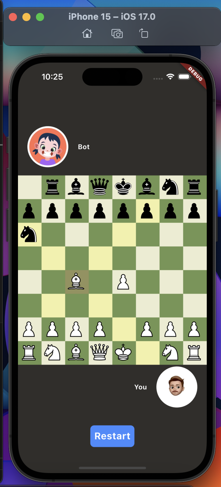

# Chess

This is a chess application built using the Flutter framework. The app allows you to play chess against a computer opponent that uses the MiniMax algorithm.

## Screenshots



## Features

- **Play Against Bot**: Challenge yourself against a computer opponent powered by the MinMax algorithm.
- **Intuitive UI**: Enjoy a clean and user-friendly interface designed with Flutter.
- **Move Highlights**: Visual indicators for possible moves and checks.

## Installation

To get started with chess, follow these steps:

1. **Clone the Repository**:

   ```bash
   git clone https://github.com/emeleonufavour/chess.git
   cd chess
   ```

2. **Install Dependencies**:
   Ensure you have Flutter installed on your system. Then, run:

   ```bash
   flutter pub get
   ```

3. **Run the App**:
   Connect a device or start an emulator, then execute:
   ```bash
   flutter run
   ```

## MinMax Algorithm

The Computer opponent uses the MinMax algorithm with alpha-beta pruning to determine the best move.
The depth of the algorithm can be adjusted in the makeBotMove() function in lib/services/chess_service.dart to increase or decrease the difficulty level of the AI.

## Features yet to add

- **Multiple difficulty level option in the UI**
- **P2P Multiplayer support**
- **Previous Move Highlight**

## Contributing

Feel free to contribute to the project. Here is how to contribute:

1. **Fork the Repository**:

   ```bash
   git clone https://github.com/emeleonufavour/chess.git
   cd chess
   ```

2. **Clone your fork**:

   ```bash
   git clone https://github.com/emeleonufavour/chess.git
   cd chess
   ```

3. **Create a branch**:

   ```bash
   git checkout -b feature-branch
   ```

4. **Make Your Changes: Implement your feature or bugfix.**

5. **Commit your changes**:

   ```bash
   git commit -m "Describe your changes"
   ```

6. **Push your fork**:

   ```bash
   git push origin feature-branch
   ```

7. **Create a Pull Request: Open a pull request to the main repository.**
